# Comarques de Catalunya

---

Deck: Comarques de Catalunya
Tags: catalunya

1. Quina és la capital de la comarca de l'**Alt Camp**?
> La capital de la comarca de l'Alt Camp és **Valls**.
>
> 

2. De quina comarca **Valls** és la capital?
> Valls és la capital de l'**Alt Camp**.
>
> 

3. Quina és la capital de la comarca de l'**Alt Empordà**?
> La capital de la comarca de l'Alt Empordà és **Figueres**.
>
> 

4. De quina comarca **Figueres** és la capital?
> Figueres és la capital de l'**Alt Empordà**.
>
> 

5. Quina és la capital de la comarca de l'**Alt Penedès**?
> La capital de la comarca de l'Alt Penedès és **Vilafranca del Penedès**.
>
> 

6. De quina comarca **Vilafranca del Penedès** és la capital?
> Vilafranca del Penedès és la capital de l'**Alt Penedès**.
>
> 

7. Quina és la capital de la comarca de l'**Alt Urgell**?
> La capital de la comarca de l'Alt Urgell és **La Seu d'Urgell**.
>
> 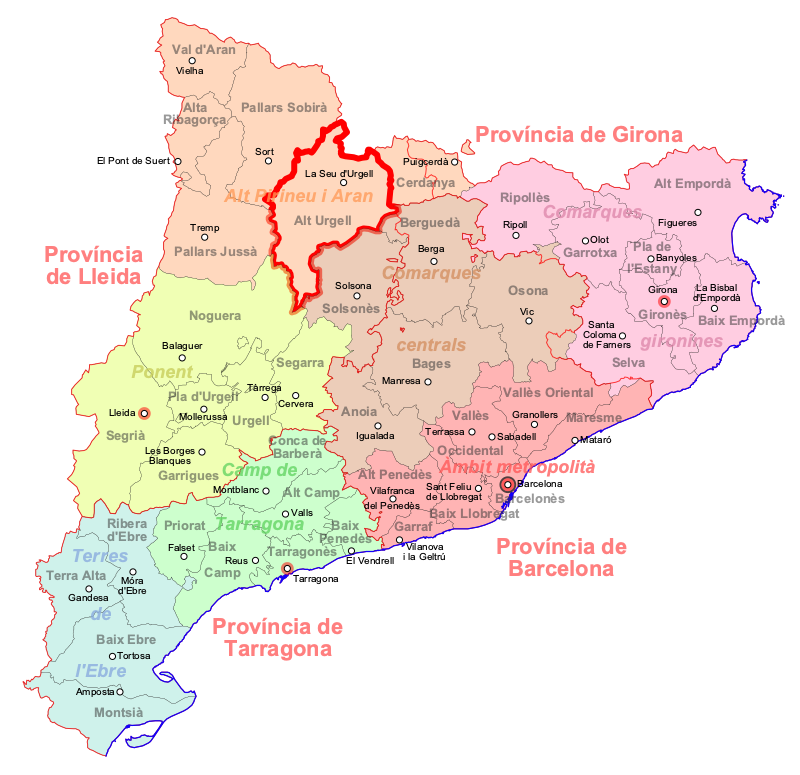

8. De quina comarca **La Seu d'Urgell** és la capital?
> La Seu d'Urgell és la capital de l'**Alt Urgell**.
>
> 
9. Quina és la capital de la comarca de l'**Alta Ribagorça**?
> La capital de la comarca de l'Alta Ribagorça és **El Pont de Suert**.
>
> 
10. De quina comarca **El Pont de Suert** és la capital?
> El Pont de Suert és la capital de l'**Alta Ribagorça**.
>
> 

11. Quina és la capital de la comarca de l'**Anoia**?
> La capital de la comarca de l'Anoia és **Igualada**.
>
> 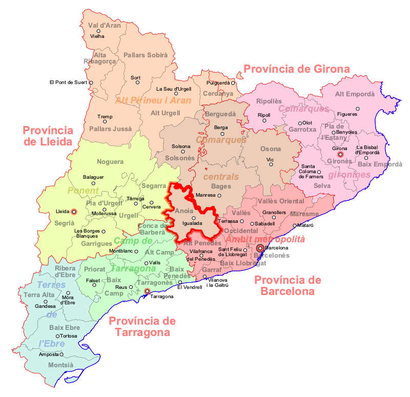

12. De quina comarca **Igualada** és la capital?
> Igualada és la capital de l'**Anoia**.
>
> 

13. Quina és la capital de la comarca del **Bages**?
> La capital de la comarca del Bages és **Manresa**.
>
> 

14. De quina comarca **Manresa** és la capital?
> Manresa és la capital del **Bages**.
>
> 

15. Quina és la capital de la comarca del **Baix Camp**?
> La capital de la comarca del Baix Camp és **Reus**.
>
> 

16. De quina comarca **Reus** és la capital?
> Reus és la capital del **Baix Camp**.
>
> 

17. Quina és la capital de la comarca del **Baix Ebre**?
> La capital de la comarca del Baix Ebre és **Tortosa**.
>
> 

18. De quina comarca **Tortosa** és la capital?
> Tortosa és la capital del **Baix Ebre**.
>
> 

19. Quina és la capital de la comarca del **Baix Empordà**?
> La capital de la comarca del Baix Empordà és **La Bisbal d'Empordà**.
>
> 

20. De quina comarca **La Bisbal d'Empordà** és la capital?
> La Bisbal d'Empordà és la capital del **Baix Empordà**.
>
> 

21. Quina és la capital de la comarca del **Baix Llobregat**?
> La capital de la comarca del Baix Llobregat és **Sant Feliu de Llobregat**.
>
> 

22. De quina comarca **Sant Feliu de Llobregat** és la capital?
> Sant Feliu de Llobregat és la capital del **Baix Llobregat**.
>
> 
23. Quina és la capital de la comarca del **Baix Penedès**?
> La capital de la comarca del Baix Penedès és **El Vendrell**.
>
> 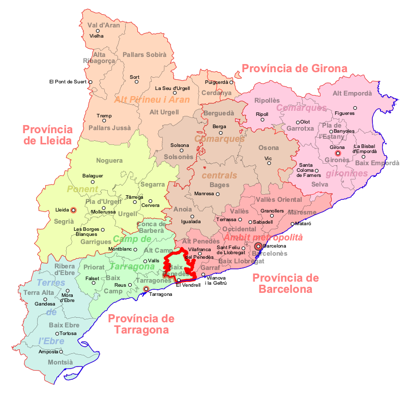
24. De quina comarca **El Vendrell** és la capital?
> El Vendrell és la capital del **Baix Penedès**.
>
> 

25. Quina és la capital de la comarca del **Barcelonès**?
> La capital de la comarca del Barcelonès és **Barcelona**.
>
> 

26. De quina comarca **Barcelona** és la capital?
> Barcelona és la capital del **Barcelonès**.
>
> 

27. Quina és la capital de la comarca del **Berguedà**?
> La capital de la comarca del Berguedà és **Berga**.
>
> 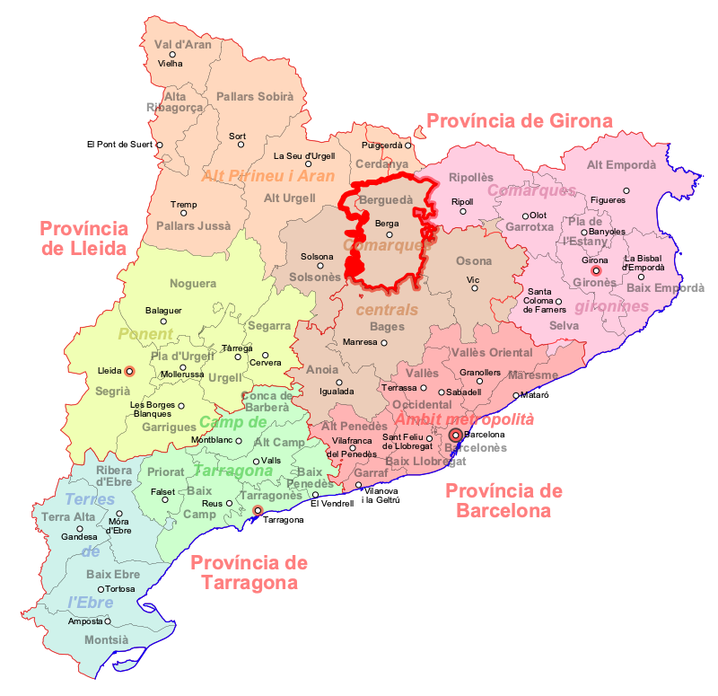

28. De quina comarca **Berga** és la capital?
> Berga és la capital del **Berguedà**.
>
> 

29. Quina és la capital de la comarca de la **Cerdanya**?
> La capital de la comarca de la Cerdanya és **Puigcerdà**.
>
> 

30. De quina comarca **Puigcerdà** és la capital?
> Puigcerdà és la capital de la **Cerdanya**.
>
> 

31. Quina és la capital de la comarca del **Conca de Barberà**?
> La capital de la comarca del Conca de Barberà és **Montblanc**.
>
> 

32. De quina comarca **Montblanc** és la capital?
> Montblanc és la capital del **Conca de Barberà**.
>
> 

33. Quina és la capital de la comarca del **Garraf**?
> La capital de la comarca del Garraf és **Vilanova i la Geltrú**.
>
> 

34. De quina comarca **Vilanova i la Geltrú** és la capital?
> Vilanova i la Geltrú és la capital del **Garraf**.
>
> 

35. Quina és la capital de la comarca de les **Garrigues**?
> La capital de la comarca del Garrigues és **Les Borges Blanques**.
>
> 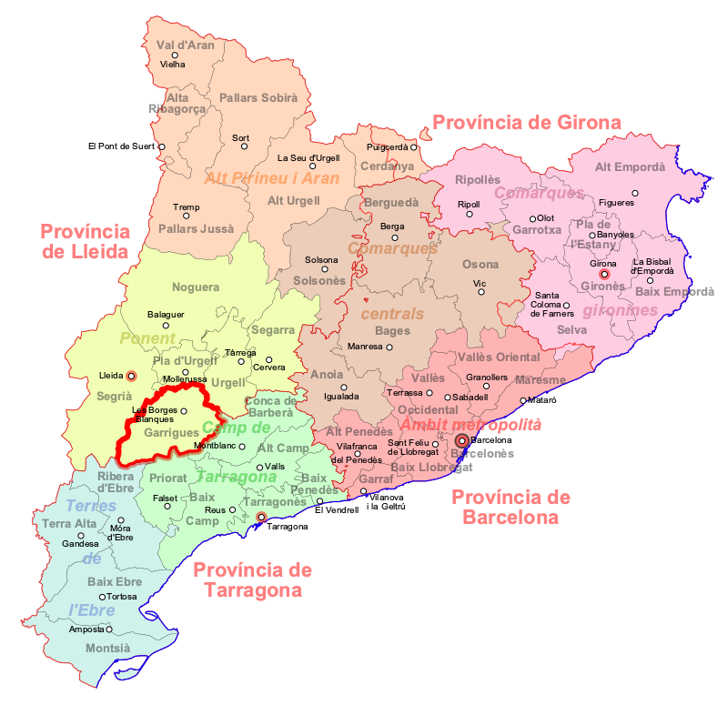

36. De quina comarca **Les Borges Blanques** és la capital?
> Les Borges Blanques és la capital de les **Garrigues**.
>
> 

37. Quina és la capital de la comarca de la **Garrotxa**?
> La capital de la comarca de la Garrotxa és **Olot**.
>
> 

38. De quina comarca **Olot** és la capital?
> Olot és la capital de la **Garrotxa**.
>
> 

39. Quina és la capital de la comarca del **Gironès**?
> La capital de la comarca del Gironès és **Girona**.
>
> 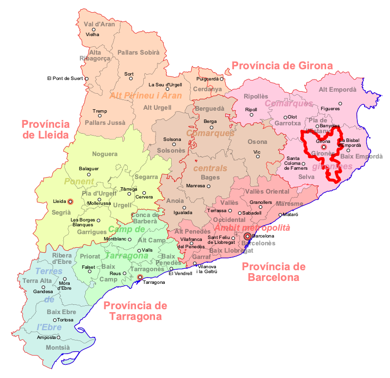

40. De quina comarca **Girona** és la capital?
> Girona és la capital del **Gironès**.
>
> 
41. Quina és la capital de la comarca del **Lluçanès**?
> La capital de la comarca del Lluçanès és **Prats de Lluçanès**.
>
> 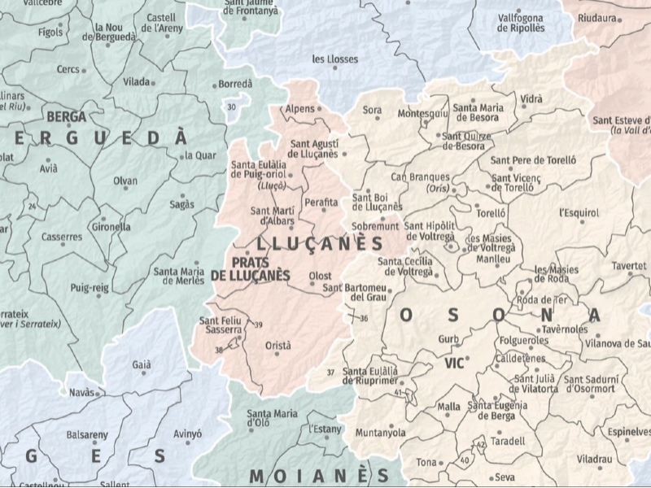
42. De quina comarca **Prats de Lluçanès** és la capital?
> El Vendrell és la capital del **Lluçanès**.
>
> 

43. Quina és la capital de la comarca del **Maresme**?
> La capital de la comarca del Maresme és **Mataró**.
>
> 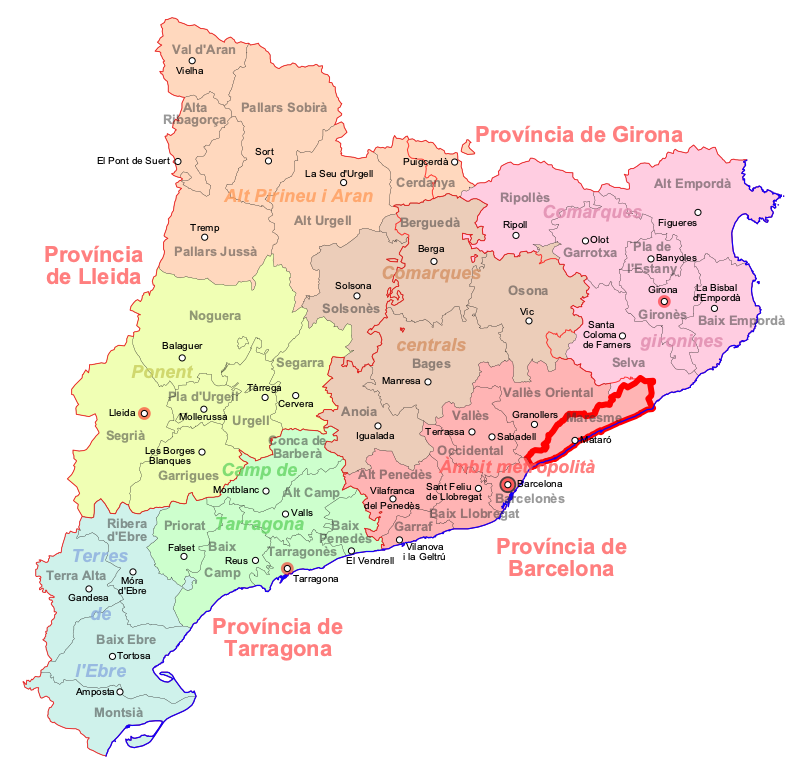

44. De quina comarca **Mataró** és la capital?
> Mataró és la capital del **Maresme**.
>
> 
45. Quina és la capital de la comarca del **Moianès**?
> La capital de la comarca del Moianès és **Moià**.
>
> 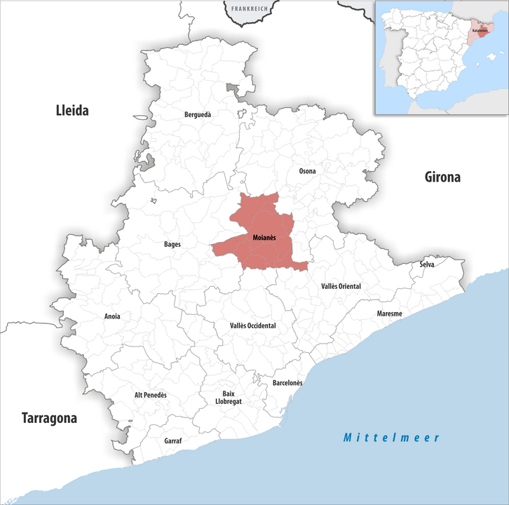
46. De quina comarca **Moià** és la capital?
> Moià és la capital del **Moianès**.
>
> 

47. Quina és la capital de la comarca del **Montsià**?
> La capital de la comarca del Montsià és **Amposta**.
>
> 

48. De quina comarca **Amposta** és la capital?
> Amposta és la capital del **Montsià**.
>
> 

49. Quina és la capital de la comarca de la **Noguera**?
> La capital de la comarca del Noguera és **Balaguer**.
>
> 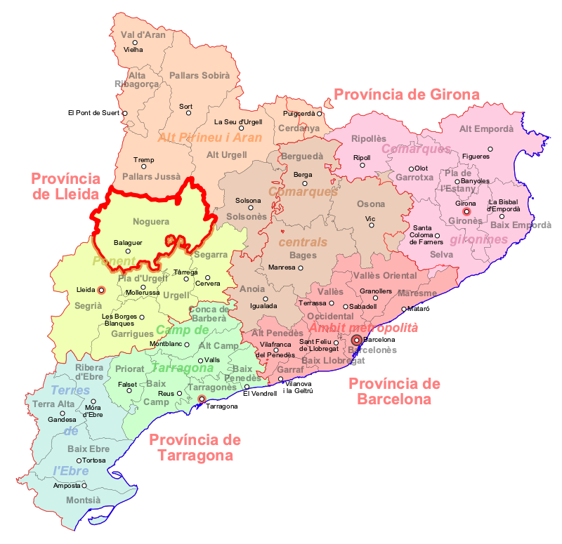

50. De quina comarca **Balaguer** és la capital?
> Balaguer és la capital de la **Noguera**.
>
> 

51. Quina és la capital de la comarca d'**Osona**?
> La capital de la comarca d'Osona és **Vic**.
>
> 

52. De quina comarca **Vic** és la capital?
> Vic és la capital d'**Osona**.
>
> 

53. Quina és la capital de la comarca del **Pallars Jussà**?
> La capital de la comarca del Pallars Jussà és **Tremp**.
>
> 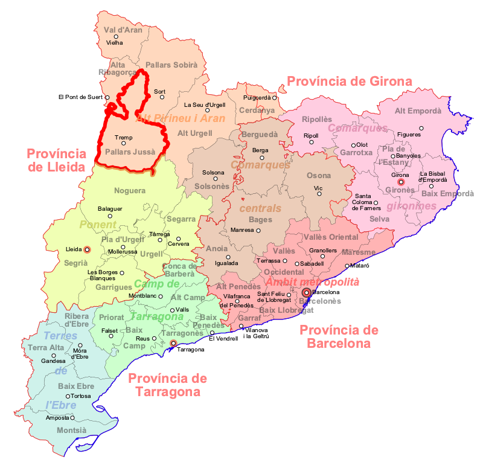

54. De quina comarca **Tremp** és la capital?
> Tremp és la capital del **Pallars Jussà**.
>
> 

55. Quina és la capital de la comarca del **Pallars Sobirà**?
> La capital de la comarca del Pallars Sobirà és **Sort**.
>
> 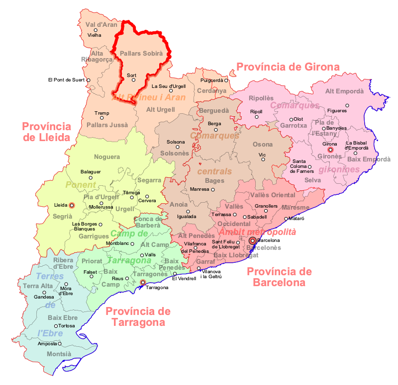

56. De quina comarca **Sort** és la capital?
> Sort és la capital del **Pallars Sobirà**.
>
> 

57. Quina és la capital de la comarca del **Pla d'Urgell**?
> La capital de la comarca del Pla d'Urgell és **Mollerussa**.
>
> 

58. De quina comarca **Mollerussa** és la capital?
> Mollerussa és la capital del **Pla d'Urgell**.
>
> 

59. Quina és la capital de la comarca del **Pla de l'Estany**?
> La capital de la comarca del Pla de l'Estany és **Banyoles**.
>
> 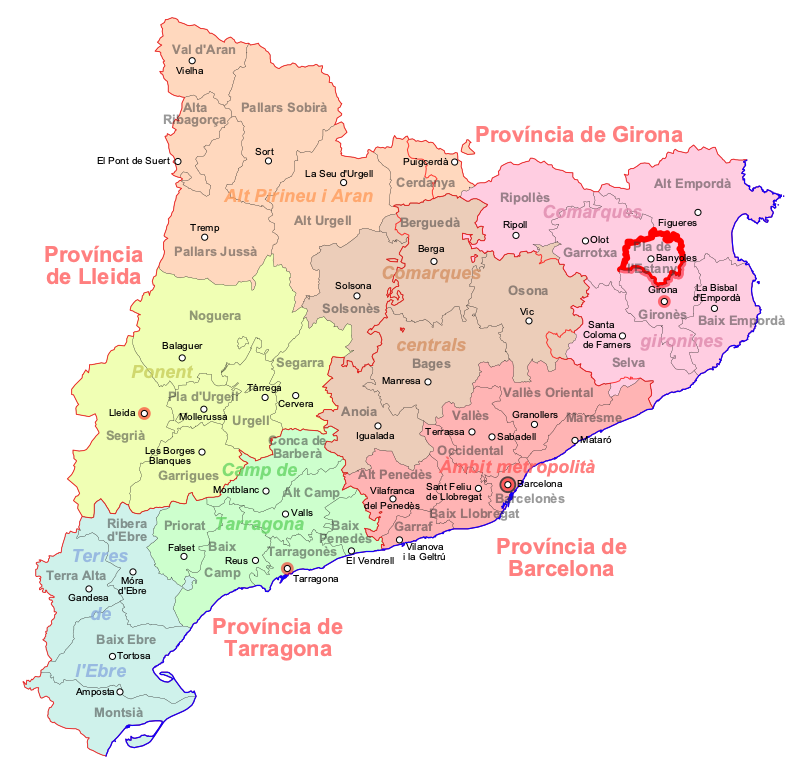

60. De quina comarca **Banyoles** és la capital?
> Banyoles és la capital del **Pla de l'Estany**.
>
> 

61. Quina és la capital de la comarca del **Priorat**?
> La capital de la comarca del Priorat és **Falset**.
>
> 

62. De quina comarca **Falset** és la capital?
> Falset és la capital del **Priorat**.
>
> 

63. Quina és la capital de la comarca de **Ribera d'Ebre**?
> La capital de la comarca de la Ribera d'Ebre és **Móra d'Ebre**.
>
> 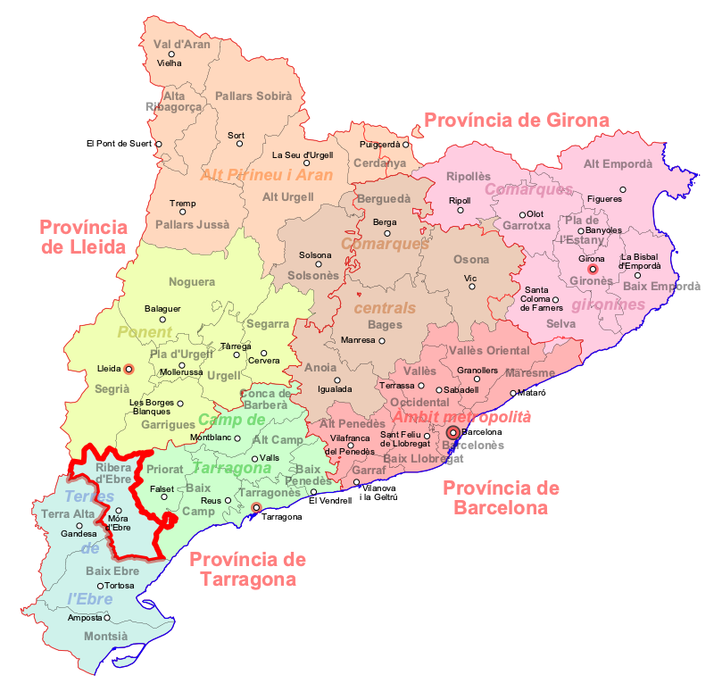

64. De quina comarca **Móra d'Ebre** és la capital?
> Móra d'Ebre és la capital de la **Ribera d'Ebre**.
>
> 

65. Quina és la capital de la comarca del **Ripollès**?
> La capital de la comarca del Ripollès és **Ripoll**.
>
> 

66. De quina comarca **Ripoll** és la capital?
> Ripoll és la capital del **Ripollès**.
>
> 

67. Quina és la capital de la comarca de la **Segarra**?
> La capital de la comarca del Segarra és **Cervera**.
>
> 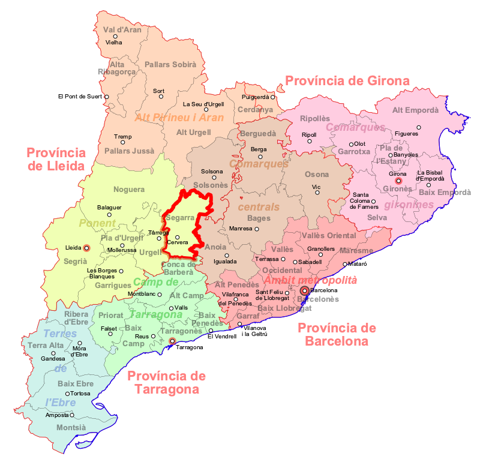

68. De quina comarca **Cervera** és la capital?
> Cervera és la capital de la **Segarra**.
>
> 

69. Quina és la capital de la comarca del **Segrià**?
> La capital de la comarca del Segrià és **Lleida**.
>
> 

70. De quina comarca **Lleida** és la capital?
> Lleida és la capital del **Segrià**.
>
> 

71. Quina és la capital de la comarca de la **Selva**?
> La capital de la comarca del Selva és **Santa Coloma de Farners**.
>
> 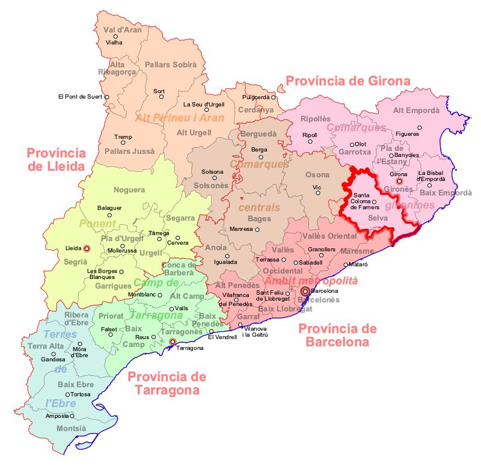

72. De quina comarca **Santa Coloma de Farners** és la capital?
> Santa Coloma de Farners és la capital de la **Selva**.
>
> 

73. Quina és la capital de la comarca del **Solsonès**?
> La capital de la comarca del Solsonès és **Solsona**.
>
> 

74. De quina comarca **Solsona** és la capital?
> Solsona és la capital del **Solsonès**.
>
> 

75. Quina és la capital de la comarca del **Tarragonès**?
> La capital de la comarca del Tarragonès és **Tarragona**.
>
> 

76. De quina comarca **Tarragona** és la capital?
> Tarragona és la capital del **Tarragonès**.
>
> 

77. Quina és la capital de la comarca de la **Terra Alta**?
> La capital de la comarca de la Terra Alta és **Gandesa**.
>
> 

78. De quina comarca **Gandesa** és la capital?
> Gandesa és la capital de la **Terra Alta**.
>
> 

79. Quina és la capital de la comarca de l'**Urgell**?
> La capital de la comarca de l'Urgell és **Tàrrega**.
>
> 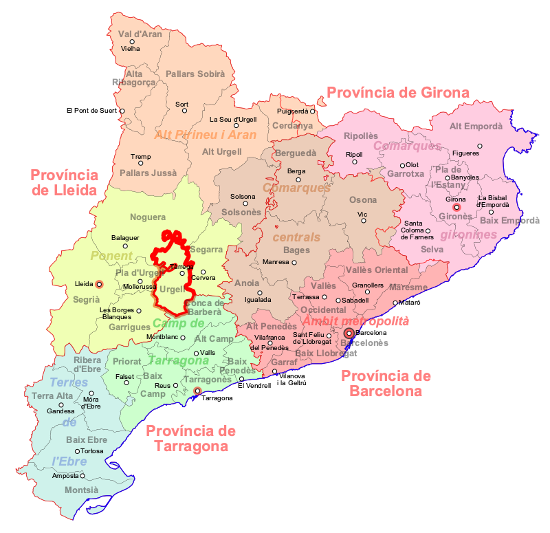

80. De quina comarca **Tàrrega** és la capital?
> Tàrrega és la capital de l'**Urgell**.
>
> 

81. Quina és la capital de la comarca de la **Vall d'Aran**?
> La capital de la comarca de la Vall d'Aran és **Vielha e Mijaran**.
>
> 

82. De quina comarca **Vielha e Mijaran** és la capital?
> Vielha e Mijaran és la capital de la **Vall d'Aran**.
>
> 

83. Quina és la capital de la comarca del **Vallès Occidental**?
> La capital de la comarca del Vallès Occidental és **Sabadell**.
>
> 

84. De quina comarca **Sabadell** és la capital?
> Sabadell és la capital del **Vallès Occidental**.
>
> 

85. Quina és la capital de la comarca del **Vallès Oriental**?
> La capital de la comarca del Vallès Oriental és **Granollers**.
>
> 

86. De quina comarca **Granollers** és la capital?
> Granollers és la capital del **Vallès Oriental**.
>
> 

---
